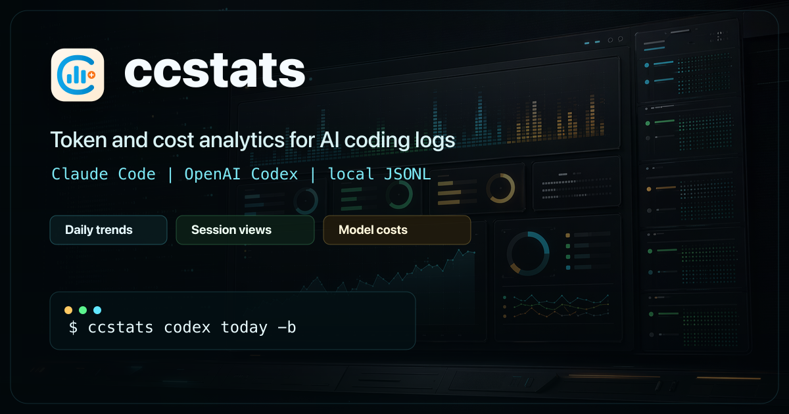

# ccstats

[](https://crates.io/crates/ccstats)
[](https://github.com/majiayu000/ccstats/releases)
[](https://github.com/majiayu000/ccstats/blob/main/LICENSE)



`ccstats` is a fast CLI for token and cost usage analytics for Claude Code, OpenAI Codex, Cursor, and Grok logs.

Search keywords: `claude code usage stats`, `codex usage stats`, `cursor usage stats`, `token usage cli`, `ai token cost tracker`.

## Highlights

- Fast local analysis of usage JSONL logs
- Claude Code support (`~/.claude/projects/`)
- OpenAI Codex support (`~/.codex/sessions/`)
- Experimental Cursor support (`Cursor/User/globalStorage/state.vscdb`)
- Grok support (`~/.grok/sessions/`)
- Daily/weekly/monthly/project/session views
- Top-N leaderboard ranking models or projects by cost share
- Optional model-level token and cost breakdown
- Reusable Rust SDK for embedding local usage and cost summaries in other apps

## Installation

### Homebrew (macOS/Linux)
```bash
brew install majiayu000/tap/ccstats
```

### Cargo binstall (prebuilt binary)
```bash
cargo binstall ccstats
```

### Cargo install (from source)
```bash
cargo install ccstats
```

### Shell script
```bash
curl -fsSL https://raw.githubusercontent.com/majiayu000/ccstats/main/install.sh | sh

# Install a specific version
curl -fsSL https://raw.githubusercontent.com/majiayu000/ccstats/main/install.sh | VERSION=v0.2.63 sh
```

### Manual download
Download prebuilt archives and SHA-256 checksums from [GitHub Releases](https://github.com/majiayu000/ccstats/releases).

## Quick Start (Codex)

```bash
# Install
brew install majiayu000/tap/ccstats

# Today
ccstats codex today

# Daily trend
ccstats codex daily

# Same result via unified source flag
ccstats daily --source codex
```

## Quick Start (Cursor)

Cursor support is experimental because Cursor's local database schema is not a public API. ccstats reads local SQLite `tokenCount` fields only and does not estimate missing usage.

```bash
# Install
brew install majiayu000/tap/ccstats

# Today
ccstats today --source cursor

# Daily trend
ccstats daily --source cursor

# Same source via alias
ccstats daily --source cur
```

## Quick Start (Grok)

Grok support reads local session `signals.json` and `summary.json` files under `~/.grok/sessions/`. These files expose context token usage, not precise provider input/output billable usage, so ccstats reports Grok context tokens as input tokens.

```bash
# Install
brew install majiayu000/tap/ccstats

# Today
ccstats today --source grok

# Daily trend
ccstats daily --source grok

# Same source via alias
ccstats daily --source gx
```

## Crate Documentation

- docs.rs: <https://docs.rs/ccstats/latest/ccstats/>
- crates.io: <https://crates.io/crates/ccstats>
- The crate-level Rustdoc in `src/lib.rs` explains the SDK entry points and CLI runtime.

## Rust SDK

`ccstats` can be used as a Rust library when another app needs structured local usage and cost data without spawning the CLI.

```rust
use ccstats::{SummaryOptions, UsageRange, UsageSource, summarize_cost_with_cli_config};

let summary = summarize_cost_with_cli_config(SummaryOptions {
    source: UsageSource::Codex,
    range: UsageRange::Today,
    ..SummaryOptions::default()
})?;

println!("today: ${:.2}", summary.cost_usd.unwrap_or(0.0));
```

The SDK uses the same source registry, parsers, aggregation logic, pricing cache, and fallback pricing as the CLI. Use `summarize_cost_with_cli_config` when SDK output should follow the same persisted CLI defaults for timezone, offline pricing, strict pricing, and currency. Use `summarize_cost` when the caller wants fully explicit options. Returned summaries include total tokens, cache read/create tokens, reasoning tokens, per-model breakdowns, `cost_usd`, and an optional converted `cost` when `SummaryOptions::currency` is set.

## Usage

### Claude Code

```bash
# Today's usage
ccstats today

# Daily breakdown
ccstats daily

# Weekly summary
ccstats weekly

# Monthly summary
ccstats monthly

# By project
ccstats project

# By session
ccstats session

# 5-hour billing blocks
ccstats blocks

# Top-N leaderboard (ranks by cost, falls back to tokens when costs unknown)
ccstats top                          # top 10 models by cost
ccstats top --dim project --limit 5  # top 5 projects

# With model breakdown
ccstats today -b

# JSON output
ccstats today -j

# Debug mode (timing info)
ccstats today --debug
```

### OpenAI Codex

```bash
# Codex subcommand mode
ccstats codex daily

# Or use unified source flag
ccstats daily --source codex

# Today's Codex usage
ccstats codex today

# Daily Codex breakdown
ccstats codex daily

# Weekly Codex summary
ccstats codex weekly

# By session
ccstats codex session

# With model breakdown
ccstats codex today -b
```

### Cursor (Experimental)

Cursor uses the unified source flag rather than a dedicated subcommand.

```bash
# Today's Cursor usage
ccstats today --source cursor

# Daily Cursor breakdown
ccstats daily --source cursor

# Weekly Cursor summary
ccstats weekly --source cursor

# By session/conversation
ccstats session --source cursor

# Cursor alias
ccstats daily --source cur
```

By default, ccstats checks these local Cursor databases:

- macOS: `~/Library/Application Support/Cursor/User/globalStorage/state.vscdb`
- Linux: `~/.config/Cursor/User/globalStorage/state.vscdb`
- `workspaceStorage/*/state.vscdb` under the same Cursor user directory

You can override the Cursor user directory with `CURSOR_HOME`:

```bash
CURSOR_HOME="/path/to/Cursor/User" ccstats daily --source cursor
```

Current limitations:

- Only explicit `tokenCount`/usage fields are counted.
- Project aggregation and 5-hour billing blocks are not supported for Cursor.
- Cache creation, cache read, and reasoning token fields are reported as zero unless Cursor exposes them directly in a supported local record.

### Grok

Grok uses the unified source flag rather than a dedicated subcommand.

```bash
# Today's Grok context-token usage
ccstats today --source grok

# Daily Grok breakdown
ccstats daily --source grok

# Weekly Grok summary
ccstats weekly --source grok

# By session
ccstats session --source grok

# By project
ccstats project --source grok

# Grok alias
ccstats daily --source gx
```

By default, ccstats checks Grok session files under:

- `~/.grok/sessions/**/signals.json`

You can override the Grok home directory with `GROK_HOME`:

```bash
GROK_HOME="/path/to/.grok" ccstats daily --source grok
```

Current limitations:

- Grok local session files expose context token usage, not exact provider input/output usage.
- ccstats reports Grok context tokens as input tokens and leaves output, cache creation, cache read, and reasoning token fields at zero.
- Grok 5-hour billing blocks are not supported.

### Common Options

```bash
# Bucket by timezone
ccstats daily --timezone UTC

# Locale-aware number formatting
ccstats monthly --locale de

# Filter by date
ccstats daily --since 20260101 --until 20260131

# Monthly budget forecast (uses --until as the as-of date when present)
ccstats monthly --monthly-budget 25 --until 20260415

# Select data source explicitly (supports aliases)
ccstats daily --source codex

# Combine all supported data sources
ccstats monthly --source all

# Experimental Cursor source (reads local SQLite tokenCount fields)
ccstats daily --source cursor

# Cursor alias
ccstats daily --source cur

# Grok source and alias
ccstats daily --source grok
ccstats daily --source gx

# Offline mode (use cached pricing)
ccstats today -O

# Compact output
ccstats today -c

# Hide cost column
ccstats today --no-cost
```

### Session CSV Columns

`ccstats session --csv` now includes:

- `reasoning_tokens`
- `cache_creation_tokens`
- `cache_read_tokens`

### Parsing Warnings

When malformed JSONL records are encountered, ccstats reports them in stderr:

```text
Warning: ignored <N> malformed records
```

## Supported Data Sources

| Source | Directory | Features |
|--------|-----------|----------|
| Claude Code | `~/.claude/projects/` | Projects, Billing Blocks, Deduplication |
| OpenAI Codex | `~/.codex/sessions/` | Reasoning Tokens |
| All Sources | Multiple | Combined daily/weekly/monthly/today/statusline summaries |
| Cursor (experimental) | Cursor `User/globalStorage/state.vscdb` | Local SQLite `tokenCount` fields only |
| Grok | `~/.grok/sessions/` | Context-token session summaries, Projects |

## Architecture

See [docs/ARCHITECTURE.md](docs/ARCHITECTURE.md) for:
- Adding new data sources
- Data flow and processing pipeline
- Caching mechanism
- Architecture and module boundaries

See [docs/algorithm/authoritative-token-accounting.md](docs/algorithm/authoritative-token-accounting.md) for:
- Token accounting rules
- Source-specific normalization
- Deduplication semantics

## License

MIT. See [LICENSE](LICENSE).
