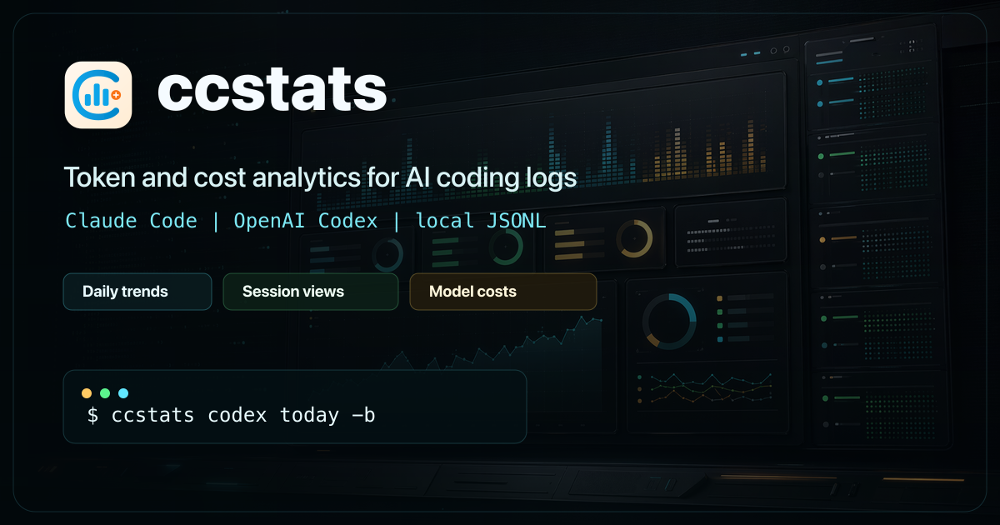

# ccstats

[](https://crates.io/crates/ccstats)
[](https://github.com/majiayu000/ccstats/releases)
[](https://github.com/majiayu000/ccstats/blob/main/LICENSE)



`ccstats` is a fast CLI for token and cost usage analytics across 11 local AI coding-agent data sources.

Search keywords: `claude code usage stats`, `codex usage stats`, `cursor usage stats`, `token usage cli`, `ai token cost tracker`.

## Highlights

- Fast local analysis of usage JSONL logs
- Claude Code support (`~/.claude/projects/`)
- OpenAI Codex support (`~/.codex/sessions/`)
- Codex weekly quota pace and reset estimates from provider snapshots
- Cursor usage API support (`CURSOR_API_KEY` or `CURSOR_SESSION_TOKEN`)
- Grok support (`~/.grok/sessions/`)
- Kimi Code support (`~/.kimi-code/sessions/`)
- Gemini CLI, Amp, and Qwen Code support
- Cline CLI plus Cline, Roo Code, and Kilo Code VS Code extension support
- Daily/weekly/monthly/project/session views
- Top-N leaderboard ranking models or projects by cost share
- Optional model-level token and cost breakdown
- Reusable Rust SDK for embedding local usage and cost summaries in other apps

## Installation

### Homebrew (macOS/Linux)
```bash
brew install majiayu000/tap/ccstats
```

### Cargo binstall (prebuilt binary)
```bash
cargo binstall ccstats
```

### Cargo install (from source)
```bash
cargo install ccstats
```

### Shell script
```bash
curl -fsSL https://raw.githubusercontent.com/majiayu000/ccstats/main/install.sh | sh

# Install a specific version
curl -fsSL https://raw.githubusercontent.com/majiayu000/ccstats/main/install.sh | VERSION=v0.2.63 sh
```

### Manual download
Download prebuilt archives and SHA-256 checksums from [GitHub Releases](https://github.com/majiayu000/ccstats/releases).

## Quick Start (Codex)

```bash
# Install
brew install majiayu000/tap/ccstats

# Today
ccstats codex today

# Daily trend
ccstats codex daily

# Weekly quota pace, remaining percentage, and reset time
ccstats quota

# Same result via unified source flag
ccstats daily --source codex
```

## Quick Start (Cursor)

Cursor usage comes from Cursor's usage API, not from local `state.vscdb` files. Enterprise teams should set `CURSOR_API_KEY`. Individual and self-serve plans should set `CURSOR_SESSION_TOKEN` to the `WorkosCursorSessionToken` cookie from [cursor.com/dashboard/usage](https://cursor.com/dashboard/usage).

```bash
# Install
brew install majiayu000/tap/ccstats

# Today
ccstats today --source cursor

# Daily trend
ccstats daily --source cursor

# Same source via alias
ccstats daily --source cur
```

## Quick Start (Grok)

Grok support reports complete, globally deduplicated token totals from session `turn_completed.usage` records. It separately prices each observed `shell.turn.inference_done` record using xAI's short- or long-context API rate for the whole request. Because Grok trims `unified.jsonl`, the output includes priced-token coverage and marks the API-equivalent cost as a lower bound when inference history is incomplete and no `estimated_proxy` contribution is included.

```bash
# Install
brew install majiayu000/tap/ccstats

# Today's Grok usage
ccstats grok today

# Daily Grok usage
ccstats grok

# Same source via alias
ccstats daily --source gx
```

## Quick Start (Kimi Code)

Kimi Code support reads per-turn `usage.record` entries from wire logs under `~/.kimi-code/sessions/`, including sub-agent usage, and reports actual input/output/cache token usage per turn.

```bash
# Install
brew install majiayu000/tap/ccstats

# Today's usage and cost
ccstats kimi today

# Daily breakdown
ccstats kimi

# Same source via alias
ccstats daily --source km
```

## Quick Start (Additional Sources)

```bash
ccstats daily --source gemini
ccstats daily --source amp
ccstats daily --source qwen
ccstats daily --source cline
ccstats daily --source roocode
ccstats daily --source kilocode
```

Gemini reads both chat JSON and headless JSONL usage. Amp reconciles its usage
ledger with assistant-message usage without double counting. Qwen reads its
native usage ledger and separates cached input from uncached input. Cline reads
both CLI sessions and its VS Code extension task logs; Roo Code and Kilo Code
use the same extension-log algorithm. Client-side credit or reported-cost
fields are not imported, so cost remains ccstats' model pricing estimate.

## Crate Documentation

- docs.rs: <https://docs.rs/ccstats/latest/ccstats/>
- crates.io: <https://crates.io/crates/ccstats>
- The crate-level Rustdoc in `src/lib.rs` explains the SDK entry points and CLI runtime.

## Rust SDK

`ccstats` can be used as a Rust library when another app needs structured local usage and cost data without spawning the CLI.

```rust
use ccstats::{SummaryOptions, UsageRange, UsageSource, summarize_cost_with_cli_config};

let summary = summarize_cost_with_cli_config(SummaryOptions {
    source: UsageSource::Codex,
    range: UsageRange::Today,
    ..SummaryOptions::default()
})?;

println!("today: ${:.2}", summary.cost_usd.unwrap_or(0.0));
```

The SDK uses the same source registry, parsers, aggregation logic, pricing cache, and fallback pricing as the CLI. Use `summarize_cost_with_cli_config` when SDK output should follow the same persisted CLI defaults for timezone, offline pricing, strict pricing, and currency. Use `summarize_cost` when the caller wants fully explicit options. Returned summaries include total tokens, cache read/create tokens, cache hit rate, reasoning tokens, per-model breakdowns, `cost_usd`, and an optional converted `cost` when `SummaryOptions::currency` is set.

Use `UsageRange::TimestampRange` with inclusive UTC `DateTime<Utc>` bounds when an app must align usage to an exact provider quota window instead of whole local dates.

Codex weekly quota pace is also available as structured SDK data without
spawning the CLI:

```rust
use ccstats::load_codex_weekly_quota;

let quota = load_codex_weekly_quota(None)?;
println!("weekly used: {:.1}%", quota.used_pct);
println!("projected at reset: {:.1}%", quota.projected_pct_at_reset);
```

Pass `Some(codex_home)` to read an explicit Codex home without modifying
process environment variables. The explicit path is authoritative and never
falls back to `CODEX_HOME` or `~/.codex`. Missing, stale, malformed, and
unreadable snapshots return typed `CodexQuotaError` values.

Apps that need several windows at once can use the batch API so source logs,
pricing, and currency are loaded once for the request:

```rust
use ccstats::{MultiSummaryOptions, UsageRange, UsageSource, summarize_cost_ranges};

let overview = summarize_cost_ranges(MultiSummaryOptions {
    source: UsageSource::Claude,
    ranges: vec![
        UsageRange::Today,
        UsageRange::ThisWeek,
        UsageRange::ThisMonth,
    ],
    timezone: None,
    offline: true,
    strict_pricing: false,
    currency: Some("USD".to_string()),
})?;

for summary in overview.summaries {
    println!("{:?}: ${:.2}", summary.range, summary.cost_usd.unwrap_or(0.0));
}
```

## Usage

### Claude Code

```bash
# Today's usage
ccstats today

# Daily breakdown
ccstats daily

# Weekly summary
ccstats weekly

# Monthly summary
ccstats monthly

# By project
ccstats project

# By session
ccstats session

# 5-hour billing blocks
ccstats blocks

# Top-N leaderboard (ranks by cost, falls back to tokens when costs unknown)
ccstats top                          # top 10 models by cost
ccstats top --dim project --limit 5  # top 5 projects

# With model breakdown
ccstats today -b

# JSON output
ccstats today -j

# Debug mode (timing info)
ccstats today --debug

# Debug model pricing resolution (written to stderr)
# Example: Pricing: glm-5.2 -> glm-5.2 (live)
# Unknown models are reported as: Pricing: <model> -> no match (unknown)
ccstats today --breakdown --strict-pricing --debug
```

By default, ccstats checks Claude Code logs under `~/.claude/projects/`.
If Claude Code uses a moved config directory, set `CLAUDE_CONFIG_DIR` to the
Claude config root:

```bash
CLAUDE_CONFIG_DIR="/path/to/claude-config" ccstats daily --source claude
```

### OpenAI Codex

```bash
# Codex subcommand mode
ccstats codex daily

# Or use unified source flag
ccstats daily --source codex

# Today's Codex usage
ccstats codex today

# Daily Codex breakdown
ccstats codex daily

# Weekly Codex summary
ccstats codex weekly

# Provider weekly quota pace (same as `ccstats quota`)
ccstats codex quota

# By session
ccstats codex session

# With model breakdown
ccstats codex today -b
```

By default, ccstats checks Codex sessions under `~/.codex/sessions/`. You can
override the Codex home directory with `CODEX_HOME`:

```bash
CODEX_HOME="/path/to/.codex" ccstats codex daily
```

#### Codex weekly quota estimate

`ccstats quota` reads the newest server-provided 10,080-minute rate-limit
snapshot from local Codex session logs. It reports the used and remaining
percentages, reset time, projected percentage at reset, and an estimated
depletion time when the current pace would exceed 100%. It also prices local
usage from the exact active quota window and divides it by the reported used
fraction to estimate the full week's API-equivalent USD value and token count.

```bash
# Human-readable table
ccstats quota

# Equivalent nested command
ccstats codex quota

# Machine-readable output
ccstats quota --json
ccstats quota --csv
```

The dollar and token figures are approximations, not official provider
allowances. They vary with the current model and cache mix; token totals are
only comparable while that mix stays similar. Dollar values use ccstats' current
model price resolution; request-level pricing tiers may not be represented. Use
`--no-cost` to omit the value estimate. Quota estimates are reported in USD, so
an explicit non-USD `--currency` is rejected. If no current weekly snapshot
exists, the command exits with an error instead of estimating quota from token
totals.

### Cursor

Cursor uses the unified source flag rather than a dedicated subcommand.

```bash
# Today's Cursor usage
ccstats today --source cursor

# Daily Cursor breakdown
ccstats daily --source cursor

# Weekly Cursor summary
ccstats weekly --source cursor

# By session/conversation
ccstats session --source cursor

# Cursor alias
ccstats daily --source cur
```

Authenticate with one of:

```bash
# Enterprise Admin API key from cursor.com/dashboard/api
CURSOR_API_KEY="..." ccstats daily --source cursor

# Dashboard session cookie for individual / self-serve plans
CURSOR_SESSION_TOKEN="..." ccstats daily --source cursor
```

`CURSOR_API_KEY` calls `POST https://api.cursor.com/teams/filtered-usage-events`. `CURSOR_SESSION_TOKEN` calls the dashboard usage-events endpoint used by [cursor.com/dashboard/usage](https://cursor.com/dashboard/usage). For tests or offline replay, point `CURSOR_USAGE_FILE` at a saved JSON payload.

Current limitations:

- ccstats does not read local Cursor SQLite auth tokens. Set `CURSOR_API_KEY` or `CURSOR_SESSION_TOKEN` explicitly.
- Project aggregation and 5-hour billing blocks are not supported for Cursor.
- Dashboard session cookies expire; refresh `CURSOR_SESSION_TOKEN` when requests start failing.
- Self-serve plans may return token counts with `$0` event costs. ccstats records that billed amount instead of estimating Cursor subscription cost from LiteLLM prices.

### Grok

```bash
# Today's Grok usage
ccstats grok today

# Daily Grok usage
ccstats grok

# Weekly Grok usage
ccstats grok weekly

# By session
ccstats grok session

# By project
ccstats grok project

# Grok alias
ccstats daily --source gx
```

By default, ccstats uses:

- `~/.grok/sessions/**/updates.jsonl` for complete per-turn token totals
- `~/.grok/logs/unified.jsonl` for per-inference API-equivalent pricing
- `~/.grok/sessions/**/summary.json` for model, project, and session metadata
- the platform application-data directory under `ccstats/grok/<source-root>/inference-v1.jsonl` for the durable, deduplicated ledger

For Grok 4.5 and 4.6, requests below 200k prompt tokens use the short-context rates. Requests at or above 200k use the long-context input, cached-input, and output rates for the entire inference. `completion_tokens` already includes reasoning, so ccstats does not charge reasoning twice. Rates follow the [xAI pricing reference](https://docs.x.ai/developers/pricing).

Structured period output includes `api_equivalent_cost_coverage` with `total_tokens`, `priced_tokens`, `percent`, `complete`, and `cost_is_lower_bound`. If a session has no `turn_completed.usage`, ccstats retains its explicitly labeled `estimated_proxy` context-snapshot fallback.

You can override the Grok home directory with `GROK_HOME`:

```bash
GROK_HOME="/path/to/.grok" ccstats grok
```

Current limitations:

- The durable ledger starts when ccstats first observes an inference. It cannot recover records Grok trimmed before the first run or between ccstats runs, so incomplete API-equivalent cost is reported as a lower bound only when no `estimated_proxy` contribution is included.
- `turn_completed.usage.costUsdTicks` is not used as an API-equivalent price.
- Grok models without a published ccstats per-inference tier remain unpriced and reduce priced-token coverage.
- Grok 5-hour billing blocks are not supported.

### Kimi Code

```bash
# Today's Kimi Code usage and cost
ccstats kimi today

# Daily Kimi Code breakdown
ccstats kimi

# Weekly Kimi Code summary
ccstats kimi weekly

# By session
ccstats kimi session

# By project
ccstats kimi project

# Kimi alias
ccstats daily --source km
```

By default, ccstats reads Kimi Code wire logs under:

- `~/.kimi-code/sessions/*/*/agents/*/wire.jsonl` (main and sub-agent per-turn `usage.record` entries)
- `~/.kimi-code/session_index.jsonl` for session-to-project mapping

You can override the Kimi Code home directory with `KIMI_CODE_HOME`:

```bash
KIMI_CODE_HOME="/path/to/.kimi-code" ccstats kimi
```

Current limitations:

- Kimi Code subscription models (e.g. `kimi-code/k3`) have no public per-token pricing; costs use fallback estimates based on Moonshot's official `kimi-k2.6` API rates and are marked as `fallback` in structured output. Use `--strict-pricing` to show N/A instead.
- Cache creation tokens are reported but priced at $0 by the Kimi fallback estimate (Moonshot does not publish a separate cache-creation rate).
- Kimi 5-hour billing blocks and tool-call statistics are not supported.

### Common Options

```bash
# Bucket by timezone
ccstats daily --timezone UTC

# Locale-aware number formatting
ccstats monthly --locale de

# Filter by date
ccstats daily --since 20260101 --until 20260131

# Monthly budget forecast (uses --until as the as-of date when present)
ccstats monthly --monthly-budget 25 --until 20260415

# Select data source explicitly (supports aliases)
ccstats daily --source codex

# Combine all supported data sources
ccstats monthly --source all

# Cursor source (usage API)
ccstats daily --source cursor

# Cursor alias
ccstats daily --source cur

# Grok source and alias
ccstats daily --source grok
ccstats daily --source gx

# Kimi Code source and alias
ccstats daily --source kimi
ccstats daily --source km

# Additional local agent sources
ccstats daily --source gemini
ccstats daily --source amp
ccstats daily --source qwen
ccstats daily --source cline
ccstats daily --source roocode
ccstats daily --source kilocode

# Offline mode (use cached pricing)
ccstats today -O

# Compact output
ccstats today -c

# Hide cost column
ccstats today --no-cost
```

### Configuration

ccstats reads an optional TOML config file before command execution. CLI flags
override config values.

Search order:

1. `~/.config/ccstats/config.toml`
2. Platform config directory: for example
   `~/Library/Application Support/ccstats/config.toml` on macOS
3. `~/.ccstats.toml`

The first existing config file wins. If that file exists but cannot be read,
has invalid TOML, or has a wrong field type, ccstats exits with an error. It
does not fall back to defaults or lower-priority config paths. If no config file
exists, defaults are used.

Example `config.toml`:

```toml
source = "codex"
timezone = "Asia/Shanghai"
locale = "en"
currency = "USD"
offline = true
strict_pricing = true
compact = true
breakdown = false
order = "desc"
color = "auto"
cost = "show"
```

Supported keys:

| Key | Type | Values |
|-----|------|--------|
| `offline` | boolean | `true` or `false` |
| `compact` | boolean | `true` or `false` |
| `no_cost` | boolean | `true` or `false` |
| `no_color` | boolean | `true` or `false` |
| `breakdown` | boolean | `true` or `false` |
| `debug` | boolean | `true` or `false` |
| `strict_pricing` | boolean | `true` or `false` |
| `order` | string | `asc`, `desc` |
| `color` | string | `auto`, `always`, `never` |
| `cost` | string | `show`, `hide` |
| `timezone` | string | IANA timezone such as `UTC` or `Asia/Shanghai` |
| `locale` | string | Locale used for number formatting, such as `en` or `de` |
| `currency` | string | Currency code such as `USD`, `CNY`, or `EUR` |
| `source` | string | Source name or alias such as `claude`, `codex`, `gemini`, `amp`, `qwen`, `cline`, `roocode`, `kilocode`, or `all` |

Source root env overrides are independent of config keys:

| Source | Env var | Value | Default when unset |
|--------|---------|-------|--------------------|
| Claude Code | `CLAUDE_CONFIG_DIR` | Claude config root containing `projects/` | `~/.claude` |
| OpenAI Codex | `CODEX_HOME` | Codex root containing `sessions/` and `archived_sessions/` | `~/.codex` |
| Cursor | `CURSOR_API_KEY` or `CURSOR_SESSION_TOKEN` | Admin API key or dashboard session cookie | No default; optional `CURSOR_USAGE_FILE` replay |
| Grok | `GROK_HOME` | Grok root containing `sessions/` | `~/.grok` |
| Kimi Code | `KIMI_CODE_HOME` | Kimi Code root containing `sessions/` | `~/.kimi-code` |
| Gemini CLI | `GEMINI_CLI_HOME` | Gemini CLI root containing `tmp/` | `~/.gemini` |
| Amp | `XDG_DATA_HOME` | User data root containing `amp/threads/` | `~/.local/share` |
| Qwen Code | `QWEN_RUNTIME_DIR`, then `QWEN_HOME` | Qwen root containing `usage/` | `~/.qwen` |
| Cline CLI | `CLINE_SESSION_DATA_DIR` | Cline session directory | `~/.cline/data/sessions` |

Cline also recognizes `CLINE_DATA_DIR` and `CLINE_DIR`. Roo Code and Kilo Code
currently use their standard local directories.

### Session CSV Columns

`ccstats session --csv` now includes:

- `reasoning_tokens`
- `cache_creation_tokens`
- `cache_read_tokens`
- `cache_hit_rate`

### Cache Hit Rate

Statistical table, JSON, CSV, statusline, top, session, project, and block outputs
report prompt-cache hit rate as:

```text
cache_read / (input + cache_creation + cache_read) * 100
```

Table output uses one decimal place and a `%` suffix. JSON uses the numeric
`cache_hit_rate` field, while CSV uses a two-decimal `cache_hit_rate` column.
Claude, Codex, Cursor, Grok, Kimi Code, Gemini CLI, Amp, Qwen Code, Cline, Roo
Code, and Kilo Code expose the required cache-read metric. Mixed `--source all`
output reports the aggregate rate across all selected usage.

### Parsing Warnings

When malformed JSONL records are encountered, ccstats reports them in stderr:

```text
Warning: ignored <N> malformed records
```

## Supported Data Sources

| Source | Directory | Override | Features |
|--------|-----------|----------|----------|
| Claude Code | `~/.claude/projects/` | `CLAUDE_CONFIG_DIR` | Projects, Billing Blocks, Deduplication |
| OpenAI Codex | `~/.codex/sessions/` and `~/.codex/archived_sessions/` | `CODEX_HOME` | Reasoning Tokens, cumulative-event deduplication |
| All Sources | Multiple | Source-specific env vars | Combined daily/weekly/monthly/today/statusline summaries |
| Cursor | Cursor usage API | `CURSOR_API_KEY` / `CURSOR_SESSION_TOKEN` | Per-event tokens, cache tokens, recorded `chargedCents` |
| Grok | `~/.grok/sessions/`, `~/.grok/logs/unified.jsonl` | `GROK_HOME` | Complete turn tokens, per-inference API pricing, coverage metadata, Projects, Cache / reasoning tokens, 200k pricing tier |
| Kimi Code | `~/.kimi-code/sessions/` | `KIMI_CODE_HOME` | Per-turn usage records, Projects, Cache tokens |
| Gemini CLI | `~/.gemini/tmp/` | `GEMINI_CLI_HOME` | Chat/headless formats, Reasoning and cache tokens |
| Amp | `~/.local/share/amp/threads/` | `XDG_DATA_HOME` | Ledger/message reconciliation, Cache tokens |
| Qwen Code | `~/.qwen/usage/token-usage-*.jsonl` | `QWEN_RUNTIME_DIR`, `QWEN_HOME` | Native usage ledger, Reasoning and cache tokens |
| Cline | `~/.cline/data/sessions/` and VS Code global storage | `CLINE_SESSION_DATA_DIR`, `CLINE_DATA_DIR`, `CLINE_DIR` | CLI and extension sessions, Projects, Cache tokens |
| Roo Code | VS Code global storage | — | Extension task usage, Cache tokens |
| Kilo Code | VS Code global storage | — | Extension task usage, Cache tokens |

## Architecture

See [docs/ARCHITECTURE.md](docs/ARCHITECTURE.md) for:
- Adding new data sources
- Data flow and processing pipeline
- Caching mechanism
- Architecture and module boundaries

See [docs/algorithm/authoritative-token-accounting.md](docs/algorithm/authoritative-token-accounting.md) for:
- Token accounting rules
- Source-specific normalization
- Deduplication semantics

See [docs/research/provider-algorithm-audit-2026-08-31.md](docs/research/provider-algorithm-audit-2026-08-31.md)
for the pinned competitor comparison, official-schema evidence, and
adopt/adapt/reject decisions behind the additional providers.

## License

MIT. See [LICENSE](LICENSE).
