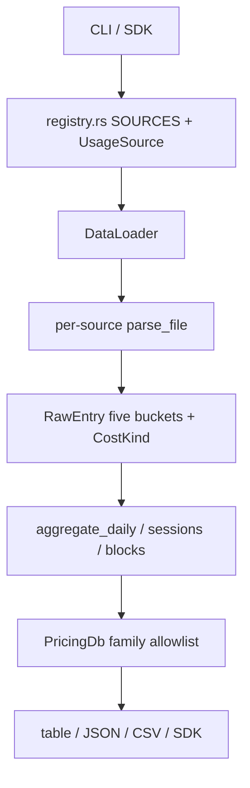
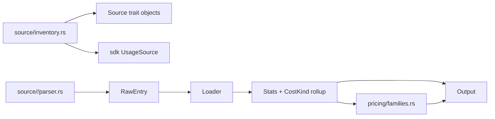

# Provenance, Pricing Families, and Source Inventory

**Status:** Proposed
**Created:** 2026-09-02
**Baseline:** `origin/main` `6bec20d`
**Audit:** [`docs/audits/2026-09-02-codebase-audit.md`](../audits/2026-09-02-codebase-audit.md)

This is the design that later issues/PRs must follow. Bugfix PRs implement one slice. They do not invent a second accounting model.

## Problem

**Current state:** Every source normalizes into one `RawEntry`. That is correct for the five non-overlapping token buckets. It is not sufficient for:

1. **Provenance** — Grok context snapshots, estimated proxy rows, and API-reported usage share the same `input_tokens` field. `--source all` then sums them and prices only `CostKind::Real`.
2. **Pricing families** — LiteLLM ingest is a boolean soup (`contains("claude")`, `starts_with("gpt-")`, …) that currently drops Gemini even though Gemini is a registered source.
3. **Inventory** — 29 sources are wired by hand in `registry.rs` and again in `UsageSource`. CLI nested commands, doctor hints, and README are more copies.

**Impact:** Wrong combined numbers, N/A costs for first-class sources, and a growing shotgun-surgery tax.

**Constraint:** No backward-compat shims (`AGENTS.md`). Public SDK JSON may add fields; it must not silently change the meaning of existing fields without a changelog note.

**Goal:** Make mixed-source output honest, make pricing family membership explicit, and make “add a source” a single inventory edit — without a rewrite of parsers.

## Success metrics

| Metric | Current | Target | Measurement |
|--------|---------|--------|-------------|
| All-source token total vs sum of real sources | Mixed (includes estimated-proxy) | All-source default token totals equal the sum of `CostKind::Real` rows | Fixture with Claude real + Grok estimated-proxy |
| Gemini list-price lookup | `google/gemini` dropped | Known Gemini ids resolve from LiteLLM or fallback | Unit test on `parse_litellm_data` + `fallback_pricing` |
| 1h cache observability | Billed, not serialized | JSON/CSV/SDK expose `cache_creation_1h_tokens` | Snapshot tests on JSON + `TokenBreakdown` |
| Source add touchpoints | ≥4 files (`registry`, `sdk` enum/as_str/from_name, docs) | 1 inventory module + parser crate path | Checklist in this doc |
| Docs vs runtime source count | ARCHITECTURE lists a subset | Architecture doc names the inventory as source of truth | Registered source count matches inventory (`ccstats sources --json` includes an extra `all` sentinel; compare length minus that sentinel) |

## Current data flow



The breakages sit at three seams: `CostKind` is ignored when summing tokens for `--source all`; `parse_litellm_data` is a second, narrower product surface than the registry; `UsageSource` is a third copy of the registry.

## Proposed solution

Keep parsers. Change the **contracts between** parsers, aggregation, pricing, and output.

### 1. Provenance is a first-class aggregation key

`CostKind` already exists (`real`, `estimated_proxy`, `mixed`). Aggregation today folds it into `Stats.estimated_proxy` for **cost**, then `--source all` still displays combined token columns.

**Rule:** Output layers must never present a single token total that mixes `CostKind::Real` and `CostKind::EstimatedProxy` without naming both.

Default all-source view:

| Column | Meaning |
|---|---|
| token columns | `CostKind::Real` only |
| `estimated_proxy_tokens` (structured) | Sum of estimated-proxy buckets, optional |
| `cost` | Real-only (already `CostDisplayMode::RealOnly`) |

Single-source Grok keeps the existing `GrokCostReport` path. Do not bypass that path.

Parser invariant unchanged:

```
total_tokens = input + output + reasoning + cache_creation + cache_read
```

`cache_creation_1h` remains a **subset** of `cache_creation`, not a sixth additive bucket.

### 2. Pricing families are an allowlist type, not scattered booleans

```text
PricingFamily: Anthropic | OpenAI | Xai | Google | DeepSeek | Qwen | Glm | Moonshot
```

`parse_litellm_data` asks `PricingFamily::from_litellm_name(name)`. Unknown families are skipped on purpose. Google is included. Tests that currently require `google/gemini` to vanish must reverse.

Fallback pricing is per family + model series, still returning `None` for unknown ids (N/A, never a silent Sonnet guess).

### 3. One inventory, generated wiring

Rust cannot derive enum variants from a runtime `Vec` without a macro or build script.

**Chosen approach:** a `define_sources!` inventory in `src/source/inventory.rs` that expands:

- `SOURCES` constructors
- `UsageSource` variants
- `as_str` / `from_name`
- `VARIANTS` for tests

Parsers stay in `src/source/<name>/`. The inventory only names them.

CLI nested subcommands (`ccstats grok`, `ccstats kimi`, …) stay as optional sugar. New sources are `--source <name>` only unless a later PR adds a nested command. That removes the “must add clap enums” tax.

### 4. Source root policy (already mostly true for Grok)

Explicit env override never falls back to the default home directory. Missing override directory ⇒ no files, not “read ~/.tool instead”. Shared helper in `src/source/roots.rs` so new parsers do not reintroduce fallback.

## Alternatives considered

### Provenance

| Option | Pros | Cons | Decision |
|---|---|---|---|
| **A. Split all-source token columns (recommended)** | Honest; small diff; keeps `RawEntry` | JSON grows a field | Chosen |
| B. Drop estimated-proxy sources from `--source all` | Simplest | Hides Grok presence entirely | Rejected |
| C. New `ProxyEntry` type beside `RawEntry` | Clean types | Touches every parser and aggregator | Deferred; too large for the bug |

### Pricing families

| Option | Pros | Cons | Decision |
|---|---|---|---|
| **A. Explicit family enum + Google (recommended)** | Matches product; testable | Must maintain family list | Chosen |
| B. Ingest entire LiteLLM dump | Zero allowlist bugs | Huge cache, ambiguous aliases, $0 metadata risk | Rejected |
| C. Per-source price tables | Precise | Diverges from LiteLLM; 29 tables | Rejected |

### Inventory

| Option | Pros | Cons | Decision |
|---|---|---|---|
| A. `inventory`/`linkme` crate | Auto-register | Extra dep, harder review | Rejected for now |
| **B. `define_sources!` macro in-repo (recommended)** | One file, no new dep | Macro complexity | Chosen for a **later** PR |
| C. Stringly-typed SDK source | No enum drift | Weaker typed API | Rejected |
| D. Keep dual lists + a drift test only | Already partly true | Does not reduce add-source cost | Keep as interim until B ships |

## Target module boundaries



**Do not** put parser field semantics in `pricing/` or `output/`. Those layers consume already-normalized buckets.

**Do not** use `Capabilities::combine` AND on `has_cache_read` as the way to hide mixed-source cache hit rate once all sources claim `true`. Cache hit rate follows **whether the underlying stats have trustworthy cache-read data**, not a folded bool. That follow-up is parked until C1 ships; current `main` sets `has_cache_read: true` on every source, so the AND is a no-op.

## Implementation slices (one issue, one PR)

Order is dependency, not “all at once”. Parallel is allowed for slices that do not share files.

| Slice | Issue title | Files (expected) | Depends | Merge rule |
|---|---|---|---|---|
| 0 | Document audit + this design | `docs/audits/*`, `docs/architecture/*` | — | Docs only; no runtime change |
| 1 | Load Gemini/Google prices from LiteLLM | `src/pricing/resolver/parse.rs`, `src/pricing/resolver/fallback.rs`, tests | 0 optional | Tests prove Gemini ids price; no $0 metadata |
| 2 | Expose 1h cache creation tokens | `sdk.rs` `TokenBreakdown`, `output/json.rs`, `output/csv.rs`, tests | independent of 1 | Additive JSON field; `cache_creation` still inclusive |
| 3 | All-source token totals use real provenance only | `app.rs` all-source path, aggregator/output helpers, tests | 0 | Fixture: real + estimated-proxy; default tokens exclude proxy |
| 4 | `define_sources!` inventory | `source/inventory.rs`, `sdk.rs`, `registry.rs` | 1–3 merged | Park until 1–3 are green; high blast radius |
| Park | Rolling 5h billing blocks | `core/aggregator.rs` | Product call | Do not merge without an explicit “match ccusage” decision |
| Park | CLI `this-week` vs `weekly` rename | CLI + SDK | Breaking UX | Docs-only clarification until then |

## Risks and mitigations

| Risk | Severity | Likelihood | Mitigation |
|------|----------|------------|------------|
| All-source JSON consumers treated mixed tokens as billable | High | High today | Slice 3 changes default totals; changelog must say so |
| Gemini fallback rates go stale | Medium | High | Prefer LiteLLM; fallback is last resort; `--strict-pricing` still yields N/A |
| Inventory macro becomes unreadable | Medium | Medium | Park slice 4; keep drift test until then |
| Open desktop PR `#129` collides | Medium | Medium | Branch every slice from current `origin/main`; do not stack on `codex/provider-algorithm-audit` |
| Dirty local Codex-scope worktree | High | Certain | Remains at `refs/backup/pre-audit-remediation-20260902`; never reset that tree |

## Open questions (parked)

1. Should `ccstats weekly` grow a `--current` flag, or should SDK `ThisWeek` be renamed `this_week` in docs only?
2. Should `blocks` match Anthropic rolling windows or be renamed `clock-blocks`?
3. Should `--source all` list per-source subtotals by default, not only a combined table?

Until those are answered, implementations must not guess.

## Traceability

| Requirement | Design element | First PR |
|-------------|---------------|----------|
| Honest mixed-source tokens | Provenance rule | Slice 3 |
| Gemini cost not N/A for known models | Pricing families | Slice 1 |
| Explain 1h cache surcharge | Additive token field | Slice 2 |
| Add-source without enum drift | Inventory macro | Slice 4 (later) |
| Docs match runtime | This pair of docs | Slice 0 |
