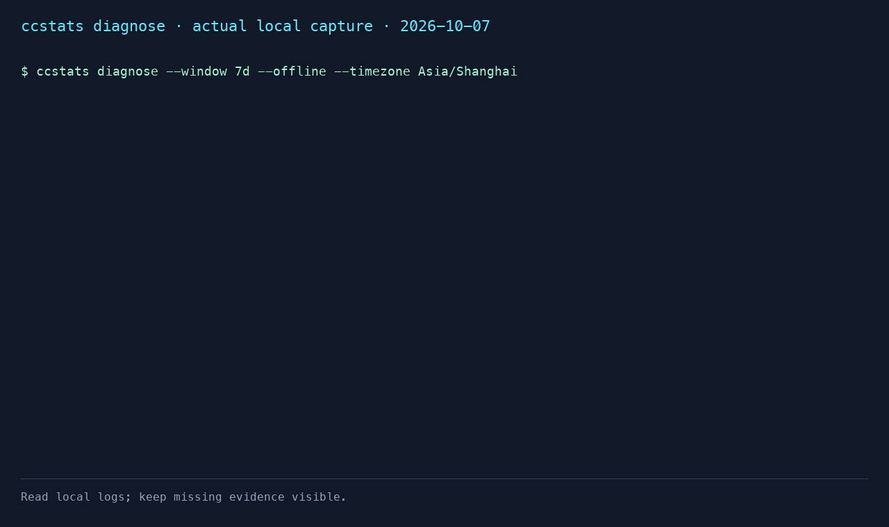

# Why is my Claude Code quota going so fast?

`ccstats diagnose` explains **locally observed token volume**. It puts token
composition, session contributors, child-agent files, compaction times, and
version comparisons in one report. It cannot reproduce Anthropic's subscription
quota formula or prove that a Claude Code version caused a billing change.

This feature is available in **[v0.10.0](https://github.com/majiayu000/ccstats/releases/tag/v0.10.0)**:

```sh
brew install majiayu000/tap/ccstats
ccstats diagnose
```

To test source changes, install into a separate prefix:

```sh
cargo install --path . --locked --root /tmp/ccstats-diagnose-install
/tmp/ccstats-diagnose-install/bin/ccstats diagnose
```

## Commands and windows

```sh
ccstats diagnose                         # rolling last five hours
ccstats diagnose --window today          # elapsed local calendar day
ccstats diagnose --window 7d             # rolling last seven days
ccstats diagnose --session SESSION_ID    # same window, one session and encoded children
ccstats diagnose --versions              # version section only, text output
ccstats diagnose --json                  # full evidence report
ccstats diagnose --timezone Asia/Shanghai
```

Claude is selected even if another source is the configured default. A conflicting
`--source` is an error. The command uses local Claude logs and existing statusline
snapshots; it does not load pricing or contact a provider. `CLAUDE_CONFIG_DIR`
can select a different Claude config root. `--no-cache` reparses; `--json --jq`
uses the existing JSON filter. CSV, date bounds, and other-device rollups are not
supported; use the window and session selectors above.

The baseline is the preceding 14 days. Five-hour and seven-day comparisons use
non-overlapping intervals of the same duration, working backwards from the
current interval's start. Five-hour baselines contain 67 complete intervals;
the unused final hour is excluded. For `today`, each preceding local day is cut
at the current local time, so a partial day is compared with partial days, with
timezone offsets respected. Windows without recorded messages are excluded.
A missing log is not treated as measured idle time. The baseline is a **median**,
not the example's arithmetic average. Fewer than two active baseline windows
produces no window anomaly claim. Seven-day reports therefore have at most two
baseline windows and should be read with that small sample in mind.

## Evidence and thresholds

| Observation | Trigger / evidence | Limit on the conclusion |
|---|---|---|
| Token volume above baseline | At least two active baseline windows, current tokens ≥ 2× median | Counts every recorded token, including cache reads; model/endpoint mix can differ |
| Cache-write share increase | ≥ 20 percentage points within exact model/endpoint, fully reported writes and at least two active baseline windows | Locate contributors and compaction times; do not infer a system-prompt change or causation |
| Subagent share | ≥ 25% of observed tokens from `subagents/` files | Parent attribution only when the directory encodes a parent session |
| 1-hour cache writes | ≥ 25% of recorded cache-write tokens | Published API write rates are 2× base input vs 1.25× for 5 minutes (1.6×); subscription weighting is unknown |
| Version change | ≥ 25% change in completed-turn median cache writes, ≥ 100 complete turns on **both** sides | Descriptive difference, not a verified regression or statistical significance claim |
| Mixed endpoints | Native and proxy heuristics both present | Compare within cohorts; a proxy may report fields or omit them |
| Missing cache writes | Field absent, separately from reported zero | Excluded from cache-share and version baselines; absence never proves zero consumption |

[Anthropic's prompt-caching documentation](https://platform.claude.com/docs/en/build-with-claude/prompt-caching)
provides the API rates. They do not reveal subscription quota weighting.

Version cohorts use the **full native model ID**, including date suffixes,
and the endpoint classification. Same endpoint classification does not prove the same network endpoint.
Versions are ordered by first observed usage
within each cohort, rather than treating version text as semantic-version order.
Unknown endpoints, unknown versions, missing writes, mixed-cohort turns, and
turns crossing the analysis range are excluded. The whole-file turn start is
retained before date filtering, so an old prefix cannot become a new full turn. Zero medians have no percentage
ratio. Each row reports complete turns **and** assistant-message counts.

A turn starts at an explicit non-meta, non-compaction-summary user prompt.
Tool-result-only user records do not start turns. A completion stop reason
(`end_turn`, `stop_sequence`, or `max_tokens`) is required for version samples.
This is a local-log approximation: aborts, missing prefixes, and unsupported
prompt content can leave a turn unattributed. Subagent turns belong to their own
files; the parent prompt is not counted again as a child turn.

Compactions are explicit `system` / `compact_boundary` records with a valid
native timestamp. They are attached to subsequent usage and counted once per
file/timestamp. A trailing compaction without subsequent usage is not included.
Their timestamps show temporal association only. ccstats does not read system
prompt differences or claim to know why a cache was rewritten.

`inference_geo == "not_available"` maps to `native`, `""` to `proxy`, other
values to `unknown`, following agent-sessions. This is an undocumented-field
**heuristic**, not proof of the network endpoint or missing cache fields.

## JSON and MCP

The envelope has `schema_version: 1`, `metric: "observed_tokens"`, UTC
`start`/`end`, `baseline_start`, `baseline_windows`, `baseline_messages`,
`baseline_median_tokens`, and nullable `token_ratio`. `usage` contains token
buckets, message/turn/compaction counts, missing-write messages and subagent
tokens. `dimensions` contains exact model/endpoint-classification cohorts and their
sample counts. `cache_share_baseline_windows` / `cache_share_baseline_messages`
count only positive-token windows with fully reported writes, separately from all
token windows. Zero token totals do not establish a cache percentage. `sessions` includes parent IDs, time bounds and compaction times.
`versions` contains completed-turn medians, sample counts, nullable changes and
an `assessment`. `findings` always include sample counts.

`official_snapshot` is null until `statusline` has collected a Claude quota
observation. When present, it retains capture time, staleness, five-hour and
seven-day windows. It is an **account-wide snapshot** and is not attributed to
the selected session or local interval. `parse_errors` and `duplicates_skipped`
retain the loader's accounting contract; nonzero parse errors mark a partial
report. Empty data yields an explicit empty report, not a fabricated cause.
An unknown session or invalid option returns a nonzero CLI exit.

```sh
claude mcp add ccstats -- ccstats mcp --offline
```

The read-only MCP `diagnose` tool accepts `window` (`5h`, `today`, `7d`) and
optional `session`. It returns the same report in text JSON and
`structuredContent`. Bad tool arguments retain `isError: true`.
[Full MCP setup](mcp.md).

No prompt text, response text, credentials, or source paths are included in the
diagnosis report. Session IDs are still identifying metadata: redact them
before sharing. The v2 usage-facts cache retains only diagnostic metadata and
usage facts. [Privacy details](PRIVACY.md).

## Comparison with existing tools

| Tool | Useful for | Where it is stronger / different |
|---|---|---|
| Claude Code `/usage` | Current plan usage and rate-limit status | The provider's own status is the source of truth for limits; ccstats cannot replace it |
| ccusage `blocks` / `session` | Local 5-hour usage blocks, session totals and live tracking | Established report and live-monitoring workflow; `diagnose` adds this project's exact-cohort version samples and explanatory evidence |
| ccstats `diagnose` | One local evidence report across cache, child files, compactions and versions | No provider billing formula, no diagnosis of unrecorded Claude web/Desktop usage, and no proof of causation |

Sources: [Claude Code command reference](https://code.claude.com/docs/en/commands),
[ccusage blocks documentation](https://github.com/ccusage/ccusage/blob/main/docs/guide/blocks-reports.md),
[shared Claude product limits](https://support.claude.com/en/articles/11647753-how-do-usage-and-length-limits-work).
The comparison does not assert that other tools lack every similar feature.

## 30-second demonstration

1. Run `ccstats diagnose --window 7d` on the machine whose logs you want to inspect.
2. Show the cache buckets and the largest sessions, then the exact-cohort version
   section and its sample counts. Keep the local-token disclaimer visible.
3. Run `ccstats diagnose --window 7d --json` to show the same evidence for agents.
4. If there is no usable data, show that result. Do not replace it with invented
   “real” consumption numbers.

The 30-second terminal animation below is a redacted rendering of the actual local command output from
2026-10-07. It demonstrates honest missing-data handling; it is **not** an
example of a measured version regression.



## Validation evidence and remaining data limit (2026-10-07)

The inspected local inventory contained five assistant usage records, all with
model `<synthetic>`, version `2.1.234`, and zero token buckets. Those records are
excluded by the existing Claude parser. There were no real compaction or child
agent records in that inspected inventory. The roadmap's 7,532-message,
13-version zero-write dataset was **not reproduced** in this execution; no
proxy attribution or regression is asserted from it.

The fixed behavioral tests are **synthetic**, following the publicly reported
native boundary shape in [anthropics/claude-code #16944](https://github.com/anthropics/claude-code/issues/16944)
and the shipped agent-sessions 0.2.2 API. They verify threshold boundaries,
absence vs zero, mixed endpoints, child attribution, user/tool boundaries,
completed-turn exclusion, cache reuse, CLI and MCP error contracts. They are
not passed off as anonymized real compaction sessions. A synthetic stress run on this Mac used 100 files, 40,000 native records and
20,000 usage records with the installed debug binary: cold read 3.16 seconds;
three cached reads 0.398 / 0.514 / 0.403 seconds (median 0.403 seconds). This
measures the cache/aggregation path, not real-world performance on the missing
historical corpus. Full-real-log performance and threshold calibration need a
usable real dataset before making that marketing claim.

## 中文说明

`ccstats diagnose` 回答的是“本地记录里的 token 花在哪里”，包括 cache 写入/
读取、模型和端点、主会话/子 agent、压缩时间，以及同一完整模型 ID 和端点内的
版本变化。默认最近 5 小时，对比此前 14 天有记录窗口的中位数；`today` 对比
相同本地时刻之前的用量，`7d` 对比两个此前七天窗口。

缺失 cache 字段不会当成零。版本比较要求两边各有至少 100 个完整轮次，低于
门槛只展示数据。官方额度来自已经保存的 statusline 快照，单独标记采集时间和
是否过期。token 构成不等于订阅额度扣减，压缩与写入的时间关联也不等于因果。
当前本机历史样本不足，规划中的历史异常未复现；这项限制保留在发布材料中。

## Launch drafts — author posts only after release verification

These are drafts. No issue replies or social posts were sent. Verify the tagged
release, clean installation, Homebrew version, and `ccstats diagnose --help`
before publishing the outreach drafts. Space releases at least
a week apart, following the Q4 launch playbook. Recheck the issue status and
whether the author has already replied before using a draft.

### Issue #16157: instantly hitting Max limits

Target: https://github.com/anthropics/claude-code/issues/16157

> A local token report cannot establish why a Max quota percentage changed:
> the account limit also covers activity outside the local CLI logs. One useful
> check is to separate recorded cache writes/reads and the largest sessions from
> the provider's own `/usage` percentage.
>
> I maintain ccstats; its new `diagnose` command collects that local evidence,
> including child-agent files and recorded compaction times. Missing fields and
> missing history remain explicit. It does not claim to explain Anthropic's
> subscription billing formula. After the release containing the command:
> `brew install majiayu000/tap/ccstats`, then `ccstats diagnose`.
> Details: https://github.com/majiayu000/ccstats/blob/main/docs/diagnose.md

### Issue #38335: March 23 change under similar workloads

Target: https://github.com/anthropics/claude-code/issues/38335

> For a before/after comparison, holding the full model ID and endpoint constant
> matters: an endpoint change or missing cache telemetry can look like a client
> version change. Assistant-message count also differs from completed turns.
>
> I added a local comparison to ccstats: `ccstats diagnose --versions` groups
> complete turns by exact model and endpoint, shows cache-write medians, and
> requires at least 100 turns on both sides before flagging a descriptive
> difference. It still cannot prove causation or reconstruct subscription quota
> weighting. After the release: `brew install majiayu000/tap/ccstats`, then
> `ccstats diagnose --versions`. Contract and limitations:
> https://github.com/majiayu000/ccstats/blob/main/docs/diagnose.md

### Issue #45756: moderate usage exhausting Max 5x in 1.5 hours

Target: https://github.com/anthropics/claude-code/issues/45756

> When examining a short session, I would keep recorded 1-hour TTL writes, child
> agents, and compaction times visible together. A temporal association is useful
> evidence, but it does not prove that compaction or TTL caused the quota jump.
> Published API cache rates likewise do not establish Max quota accounting.
>
> ccstats now has a local `diagnose` report for those fields, with message/turn
> sample counts and a separate saved official statusline snapshot when available.
> It will explicitly say when the local data is insufficient. After the release:
> `brew install majiayu000/tap/ccstats`, then `ccstats diagnose --window today`.
> Details: https://github.com/majiayu000/ccstats/blob/main/docs/diagnose.md

### X draft

> “Why did my Claude Code quota go so fast?”
>
> `ccstats diagnose` puts recorded cache tokens, child agents, compaction times,
> and version comparisons in one local report. A version difference needs
> 100 completed turns on each side, with the same exact model and endpoint.
>
> Missing data stays missing. Subscription billing remains unknown.
> [Attach the 30-second demo; link the released diagnosis documentation.]

### Reddit draft (r/ClaudeAI)

Title: I added a local Claude Code usage diagnosis report; it keeps unknown quota weighting explicit

> I maintain ccstats. The new `diagnose` command reads the logs already on your
> machine and groups cache writes/reads, session contributors, child-agent files,
> and explicit compaction times. It also compares complete turns across client
> versions while keeping model and endpoint constant.
>
> It cannot read Anthropic's quota formula or account activity absent from the
> local logs. Missing cache fields aren't treated as reported zeros; small
> version samples are shown without a regression verdict. My available local
> history did not reproduce the Q4 planning dataset, so I am not claiming it
> confirms a particular quota regression.
>
> [After release verification, add the installation commands, documentation link
> and a redacted demo. Check the community's current self-promotion rules first.]

### Follow-up checklist

- Check incoming issues daily for two weeks and respond within 48 hours.
- Record stars, downloads and traffic sources at the ends of weeks one and two.
- Add actual user questions to the FAQ; do not invent success rates or testimonials.
- Do not announce full-log speed or calibrated thresholds until those are measured
  on a usable real dataset. The current synthetic stress run is labeled separately.

### v0.10.0 release

The public registry index and Git tags were checked on 2026-10-07: the latest
version was v0.9.1 and 0.10.0 was absent. The current release workflow publishes
CLI archives, crates.io and the Homebrew formula; it no longer publishes the
deprecated desktop app. Only the root Cargo version and lockfile are release
metadata for this workflow. On 2026-10-08, `v0.10.0` was tagged at
`3a9d38d3238954430ca7c44c3b959372366d53b9` and published through the existing
[Release workflow](https://github.com/majiayu000/ccstats/actions/runs/37654657909).

Release title: `v0.10.0 — local Claude quota diagnosis`

Release summary:

- `ccstats diagnose` and the read-only MCP tool combine local token buckets,
  cache-write availability, child files, compaction times and same-cohort version
  samples. Unknown subscription weighting stays unknown.
- Baselines count usable samples; old turn prefixes cannot become new complete
  turns after date cuts; version order uses the earliest observed timestamp.
- This release also ships the already documented Unreleased limit forecasts,
  MCP usage/limits tools and user-managed device sync. The top-level
  `burn_pct_per_hour` moves under `forecast`; clients consuming that JSON must
  use the new location. The deprecated desktop app is not released.
- Install: `brew install majiayu000/tap/ccstats`, then `ccstats diagnose`.
  Confirm the installed version is `0.10.0` before announcing this feature.
- Real historical threshold calibration remains unverified; the available local
  logs did not reproduce the planning corpus. Synthetic performance results are
  explicitly labeled in the validation section above.

All five CLI archives and checksums, the public crates.io index and crate
checksum, and the public Homebrew formula were independently verified.
Fresh isolated installations from crates.io and the official macOS ARM64
installer reported `0.10.0` and passed the diagnosis help/JSON checks. The
outreach replies above remain drafts for the author to post. Follow
`docs/RELEASING.md` for future releases.
